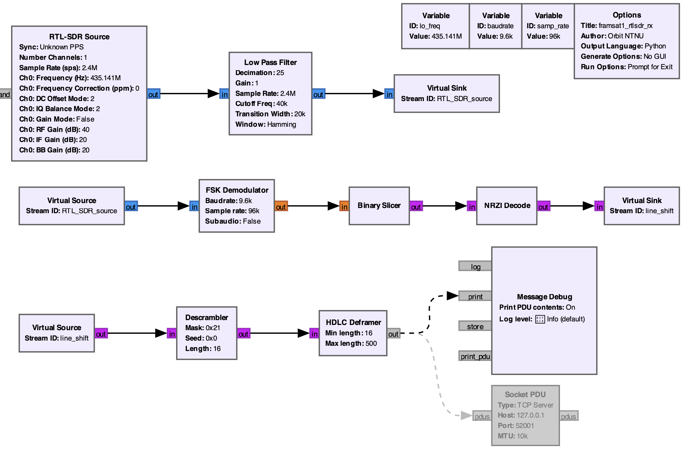

# 🛰️ FramSat-1 Downlink Frame Decoder & Receiver

Open-source GNU Radio Companion (GRC) receiver pipeline and Python frame decoder for the **FramSat-1** CubeSat by [Orbit NTNU](https://orbitntnu.com).

FramSat-1 transmits periodic AX.25 UI telemetry beacons on the 70 cm amateur satellite band. This repository provides amateur radio operators with everything needed to receive, demodulate, and extract raw packet frames.

---

## 📡 Radio Frequency & Modulation Specifications

| Parameter | Specification |
| :--- | :--- |
| **Downlink Frequency** | **435.141 MHz** (IARU Coordinated) |
| **Modulation** | GFSK (2-FSK with Gaussian filter) |
| **Baud Rate** | 9600 bps |
| **Frequency Deviation ($\Delta f$)** | $\pm 3.0$ kHz ($h \approx 0.625$) |
| **Pulse Shaping** | Gaussian ($BT = 0.5$ / $BT = 1.0$) |
| **Scrambler** | G3RUH ($1 + x^{12} + x^{17}$, Mask: `0x21`) |
| **Bit Encoding** | NRZI |
| **Frame Format** | AX.25 UI-Frame (Unnumbered Information) |
| **Satellite Callsign (Source)** | `LA1ORB` |
| **Destination Address** | `CQ` |
| **PID** | `0xF0` (No Layer 3 Protocol) |

---

## 🛠️ GNU Radio Receiver Pipeline
> **Prerequisites:** Requires GNU Radio with `gr-satellites` and `gr-osmosdr` installed (both are included out-of-the-box in [Radioconda](https://github.com/radioconda)).

The recommended receiver flowgraph (`framsat1_rx.grc`) is optimized for standard **RTL-SDR** dongles:



1. **RTL-SDR Source:** Samples at a stable `2.4 MSps` on `435.141 MHz`.
2. **Low Pass Filter (Decimator):** Decimates by `25` down to `96 kSps` with a `40 kHz` cutoff to suppress adjacent out-of-band noise.
3. **FSK Demodulator & NRZI:** Demodulates the GFSK signal and decodes transitions.
4. **Descrambler & HDLC Deframer:** Descrambles G3RUH and validates the 16-bit CRC-CCITT (FCS).

---

## 📂 Repository Contents

| File | Description |
| :--- | :--- |
| **`framsat1_rtlsdr_rx.grc`** | The main GNU Radio Companion flowgraph. Open this in GRC to view and run the receiver visually. |
| **`framsat1_rtlsdr_rx.py`** | Standalone Python script generated by GNU Radio. Can be run directly in headless environments (e.g. Raspberry Pi) without opening the GRC GUI. |
| **`framsat1_decoder.py`** | Standalone AX.25 frame decoder. Parses raw hex strings or listens to GNU Radio live via `--listen`. |
| **`FramSat_1_Reception_Guide.pdf`** | Full technical documentation and RF specification guide. |

---

## ⚡ Quickstart: Step-by-Step

### Option A: Using the Graphical Interface (Recommended)
1. Plug in your **RTL-SDR** dongle.
2. Open **`framsat1_rtlsdr_rx.grc`** in GNU Radio Companion.
3. Enable the `Socket PDU` block if you want live streaming, or leave `Message Debug` active to view frames in the GRC console.
4. Press **Execute (Play)**.

### Option B: Running Headless / Command Line
Run the SDR receiver in the background and attach the live decoder:
```bash
# Terminal 1: Start the RTL-SDR receiver
python3 framsat1_rtlsdr_rx.py

# Terminal 2: Listen and decode live frames
python3 framsat1_decoder.py --listen

## 💻 Using the Python Frame Decoder (`framsat1_decoder.py`)

The included Python script can decode historical frames or connect live to GNU Radio during a satellite pass.

### 1. Offline Frame Inspection
Pass a received hexadecimal string as a command-line argument:
```bash
python3 framsat1_decoder.py 86A240404040609882629C8EA66103F0534354657374
```

### 2. Live Demodulation via GNU Radio
In `framsat1_rx.grc`, enable the **`Socket PDU`** block (TCP Server on port `52001`). Then run:
```bash
python3 framsat1_decoder.py --listen
```
The script will connect to GNU Radio and print decoded satellite frames in real time as the satellite passes overhead!

---

## 📄 Full PDF Guide
For complete technical details, download the included [FramSat_1_Reception_Guide.pdf](FramSat_1_Reception_Guide.pdf).

## 📬 Submitting Reception Reports
We welcome reception reports and baseband recordings! Please submit reports via email to **contact@orbitntnu.com** or upload observations to the **[SatNOGS Network](https://db.satnogs.org/)** under satellite **FramSat-1**.
